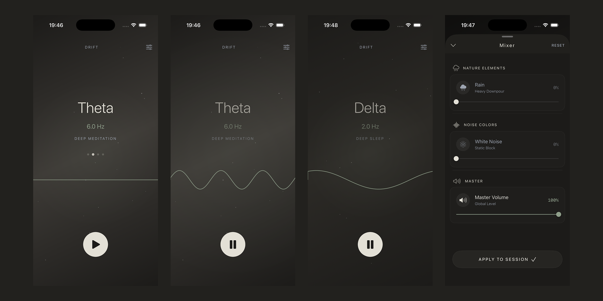

# Drift 🌊

**A high-performance, real-time audio synthesis engine for focus and relaxation.**

Drift is a native iOS application that generates **Binaural Beats** and procedural atmospheric soundscapes in real-time. Unlike typical meditation apps that play pre-recorded MP3s, Drift synthesizes audio samples on the fly using `AVAudioSourceNode`, ensuring zero looping artifacts and minimal memory footprint.

<p align="center">
  
</p>

---

## 🛠 Engineering Highlights

### 1. Real-Time Digital Signal Processing (DSP)
- **Zero Samples**: No audio files are used for the main tones. All sound is mathematically generated.
- **Real-Time Render Isolation**: Uses `AVAudioSourceNode` render callbacks created outside MainActor isolation so Core Audio can execute them safely on the high-priority IO thread.
- **Procedural Noise**: Implements a **Linear Congruential Generator (LCG)** to synthesize Brown and White noise procedurally, completely eliminating large audio assets.

### 2. Modern Swift 6 Concurrency
- **Observation Framework**: Migrated from `Combine`/`ObservableObject` to the new Swift 6 `@Observable` macro for performant, fine-grained state tracking.
- **Thread Safety**: Strict isolation between the UI (`MainActor`) and nonisolated audio render state prevents Swift 6 queue assertions during playback.

### 3. High-Performance SwiftUI
- **Canvas Drawing**: The Wave visualization uses immediate-mode `Canvas` drawing rather than `Shape` paths for optimal performance.
- **Animatable Protocol**: Custom conformance to `Animatable` enables smooth interpolation of strictly mathematical values (Frequency/Amplitude) during UI transitions.
- **TimelineView**: decouples the animation loop from the update loop, ensuring silky smooth 60/120Hz rendering.

---

## 🏗 Tech Stack

- **Language**: Swift 6
- **UI**: SwiftUI (Canvas, TimelineView, matchedGeometryEffect)
- **Audio**: `AVAudioEngine`, `AVAudioSourceNode`, `AVAudioMixerNode`
- **State Management**: Swift Observation framework (`@Observable`, `@Bindable`)
- **Architecture**: MVVM + Singleton Audio Controller
- **Tools**: Xcode 17, Git

---

## 🧠 Technical Deep Dive: The Audio Engine

The heart of Drift is the `AudioController`. Instead of playing files, it attaches a "Tap" to the audio engine using `AVAudioSourceNode`.

```swift
// Simplified logic of the Render Block
sourceNode = AVAudioSourceNode { _, _, frameCount, _ -> OSStatus in
    for frame in 0..<Int(frameCount) {
        // 1. Calculate Sine Wave for Left/Right Ears
        let valL = sin(phaseL)
        let valR = sin(phaseR)
        
        // 2. Advance phases by different increments to create Binaural Beat
        // Left: 200Hz | Right: 206Hz -> Result: 6Hz interference pattern (Theta Wave)
        phaseL += incrementL
        phaseR += incrementR
        
        // 3. Write directly to the output buffer
        bufferL[frame] = valL
        bufferR[frame] = valR
    }
    return noErr
}
```

This approach allows for instantaneous frequency shifting and "glitch-free" transitions between different brainwave states.

In Swift 6, Drift keeps the observable `AudioController` on `MainActor` while constructing the source node render callbacks in nonisolated factory methods. This avoids binding Core Audio's real-time render blocks to the main queue and keeps playback compatible with strict actor isolation.

---

## 📱 Features

- **Dynamic Binaural Beats**:
    - **Delta (2.0 Hz)**: Deep Sleep
    - **Theta (6.0 Hz)**: Meditation
    - **Alpha (10.0 Hz)**: Relaxation
    - **Beta (20.0 Hz)**: Focus
- **Audio Mixer**: Multitrack control for synthesis, rain (brown noise), and white noise layers.
- **Visual Entrainment**: A math-driven sine wave animation that perfectly matches the audio frequency.

---

## 📜 License

Created by **Jonni Akesson**.
Open for educational use.
